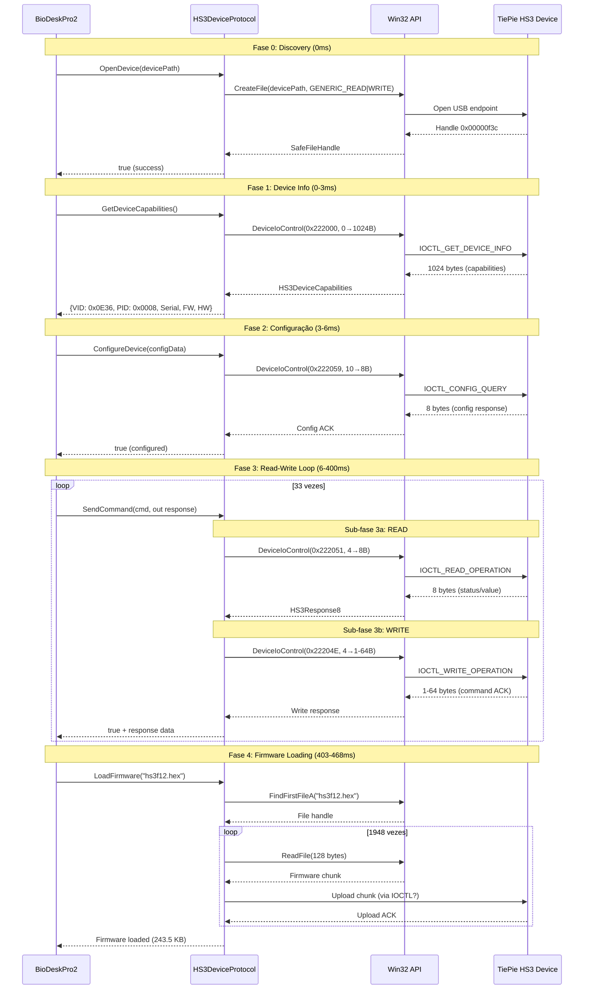
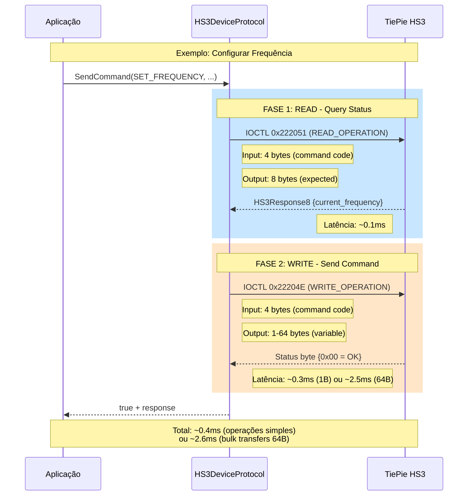
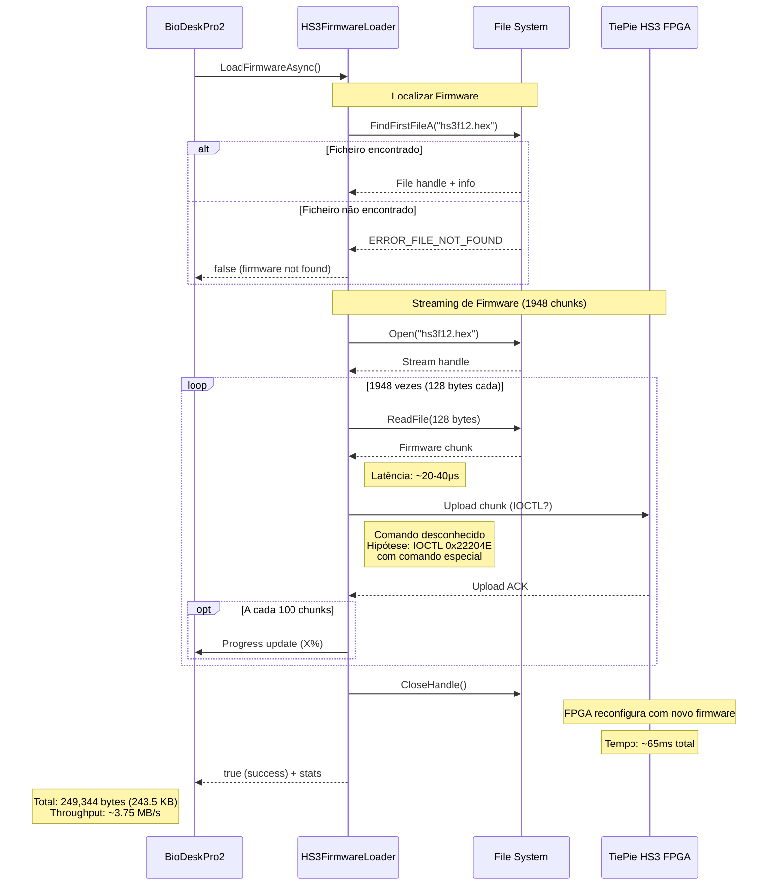
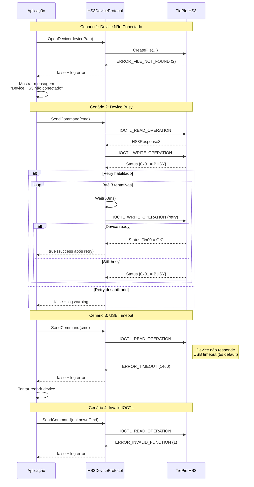
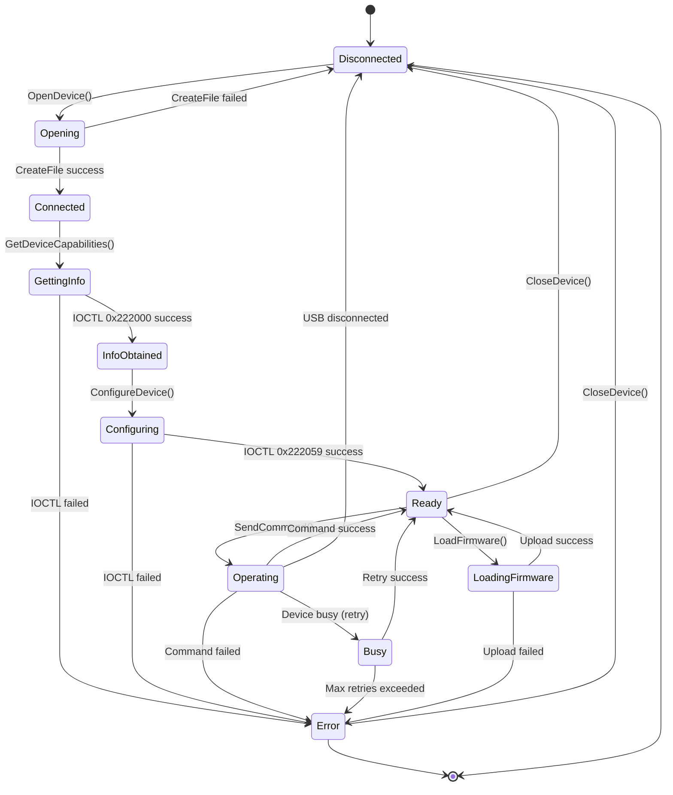
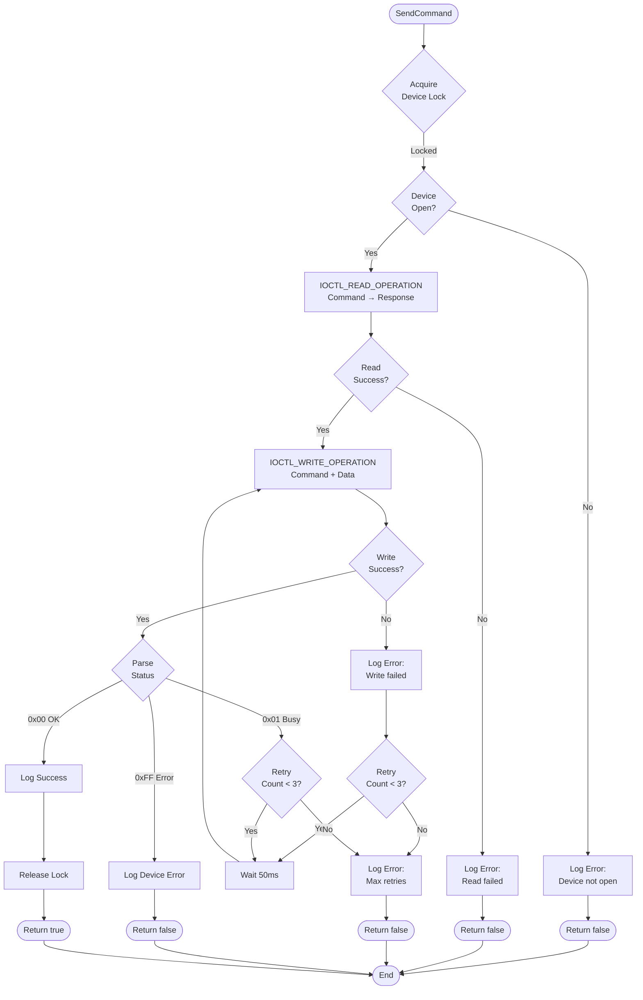

# 🔄 Diagramas de Sequência - Protocolo HS3 USB

## 📋 Índice
1. [Sequência Completa de Inicialização](#sequência-completa-de-inicialização)
2. [Padrão Read-Write Loop](#padrão-read-write-loop)
3. [Firmware Loading](#firmware-loading)
4. [Tratamento de Erros](#tratamento-de-erros)

---

## Sequência Completa de Inicialização

---

## Padrão Read-Write Loop

Este é o padrão mais comum observado no log (66 das 80 chamadas DeviceIoControl).

### Observações sobre Latências

- **Operações simples (1-8 bytes)**: 0.05-0.3ms
- **Bulk transfers (48 bytes)**: 0.3-0.4ms  
- **Bulk transfers (64 bytes - USB packet max)**: **2.5-2.6ms** ⚠️ **LATÊNCIA CRÍTICA**

**Implicação**: Batching de comandos pode melhorar throughput para operações sequenciais.

---

## Firmware Loading

### Questões em Aberto

1. **Qual IOCTL é usado para upload de firmware?**
   - Hipótese 1: IOCTL_WRITE_OPERATION (0x22204E) com comando específico
   - Hipótese 2: IOCTL não capturado pelo API Monitor (bulk transfer direto)

2. **Formato do ficheiro hs3f12.hex**
   - Intel HEX format?
   - Raw binary?
   - Precisa parsing antes de upload?

3. **Verificação de integridade**
   - Existe checksum?
   - Device valida firmware antes de aceitar?

---

## Tratamento de Erros

### Códigos de Erro Comuns

| Código Win32 | Nome | Descrição | Ação Sugerida |
|--------------|------|-----------|---------------|
| 2 | ERROR_FILE_NOT_FOUND | Device não encontrado | Verificar conexão USB |
| 5 | ERROR_ACCESS_DENIED | Acesso negado | Verificar permissões/driver |
| 6 | ERROR_INVALID_HANDLE | Handle inválido | Reabrir device |
| 1 | ERROR_INVALID_FUNCTION | IOCTL não suportado | Verificar código IOCTL |
| 1460 | ERROR_TIMEOUT | Timeout na operação | Aumentar timeout ou reset device |
| 31 | ERROR_GEN_FAILURE | Falha geral do device | Reset USB hub |

---

## Fluxo de Estado do Device

---

## Timeline Real da Captura (Primeiros 100ms)

```mermaid
gantt
    title Operações HS3 - Timeline API Monitor (10:39:26.003 - 10:39:26.105)
    dateFormat SSS
    axisFormat %L ms
    
    section Inicialização
    RegisterDeviceNotification   :milestone, 000, 0ms
    SysAllocStringLen (USB path) :milestone, 000, 0ms
    
    section Device Info
    IOCTL 0x222000 (1024B)       :crit, 000, 003
    
    section Configuração
    IOCTL 0x222059 (10→8B)       :active, 003, 006
    
    section Read-Write Loop
    READ 0x222051 (1)            :007, 008
    READ 0x222051 (2)            :008, 009
    READ 0x222051 (3)            :009, 010
    WRITE 0x22204E (1)           :011, 012
    READ 0x222051 (4)            :012, 013
    WRITE 0x22204E (2)           :013, 014
    READ 0x222051 (5)            :014, 015
    WRITE 0x22204E (3)           :026, 027
    READ 0x222051 (6)            :027, 028
    WRITE 0x22204E (4)           :042, 043
    READ 0x222051 (7)            :043, 044
    WRITE 0x22204E (5) 48B       :058, 059
    READ 0x222051 (8)            :059, 060
    WRITE 0x22204E (6) 48B       :075, 076
    READ 0x222051 (9)            :076, 077
    WRITE 0x22204E (7) 48B       :090, 091
    READ 0x222051 (10)           :091, 092
    WRITE 0x22204E (8) 48B       :105, 106
    WRITE 0x22204E (9) 64B       :crit, 105, 108
```

**Legenda**:
- 🔴 Crítico (crit): Operações que determinam sucesso da inicialização
- 🟢 Ativo (active): Operações de configuração
- ⚪ Normal: Operações regulares de read-write

---

## Implementação de Retry Logic

---

**Documentação criada por**: Copilot Coding Agent  
**Data**: 19 outubro 2025  
**Versão**: 1.0  
**Baseado em**: ApiMonitor_COM_Equipamento.txt (2034 linhas, 1948 ReadFile, 80 DeviceIoControl)
