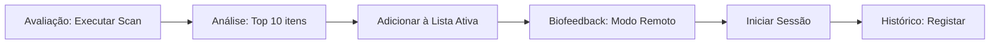
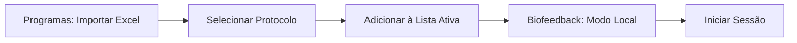
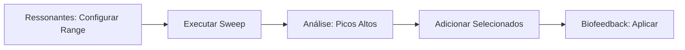

# 🌿 GUIA COMPLETO - Separador Terapias (Sistema CoRe)

**Data**: 15 de Outubro de 2025  
**Sistema Inspirador**: Inergetix CoRe 5.0 (Biofeedback & Biorressonância Informacional)  
**Status**: ✅ Sistema completo implementado com 5 sub-separadores

---

## 📋 Índice

1. [Visão Geral do Sistema CoRe](#visão-geral)
2. [Estrutura do Separador Terapias](#estrutura)
3. [Sub-separador 1: Avaliação](#avaliação)
4. [Sub-separador 2: Programas](#programas)
5. [Sub-separador 3: Ressonantes](#ressonantes)
6. [Sub-separador 4: Biofeedback](#biofeedback)
7. [Sub-separador 5: Histórico](#histórico)
8. [Onde Colar Excel com Frequências](#excel)
9. [Fluxo de Trabalho Típico](#fluxo)

---

## 🎯 Visão Geral do Sistema CoRe {#visão-geral}

O **separador Terapias** integra os princípios do sistema **Inergetix CoRe 5.0**, um sistema de biofeedback e biorressonância que utiliza:

- **Gerador de Eventos Aleatórios (RNG)**: Para avaliar ressonância informacional
- **Scanning de Valores %**: Avaliação quantitativa de protocolos terapêuticos
- **Transmissão Informacional**: Aplicação local (energética) ou remota (informacional)
- **Auto-stop por Improvement%**: Sistema inteligente que para quando atinge melhoria desejada

### Conceitos-Chave

| Conceito | Descrição |
|----------|-----------|
| **Value %** | Percentagem de ressonância informacional (0-100%) entre protocolo e cliente |
| **Improvement %** | Percentagem de melhoria conseguida após aplicação do protocolo |
| **RNG (Random Event Generator)** | Gerador quântico/pseudo-aleatório para medição de ressonância |
| **Scanning** | Processo de avaliar múltiplos protocolos com 10 amostras RNG cada |
| **Lista Ativa** | Conjunto de protocolos selecionados para aplicação terapêutica |
| **Ancora** | Identificador único do cliente (nome + data nascimento, foto, etc.) |

---

## 🏗️ Estrutura do Separador Terapias {#estrutura}

O separador **🌿 Terapias** contém **5 sub-separadores** organizados num fluxo de trabalho lógico:

```
🌿 Terapias
├── 📊 Avaliação      → Scanning de itens do Banco Core (156 itens)
├── 📝 Programas      → Gestão de protocolos de frequências (Excel)
├── 🎵 Ressonantes    → Sweep de frequências ressonantes (10 Hz - 2 kHz)
├── ⚡ Biofeedback    → Aplicação terapêutica (Local/Remoto)
└── 📜 Histórico      → Registo de sessões anteriores
```

---

## 📊 Sub-separador 1: Avaliação {#avaliação}

**Objetivo**: Executar scan RNG sobre os 156 itens do Banco Core Informacional para determinar quais têm maior ressonância com o cliente.

### Campos da Secção "Configuração do Scan"

#### 1. **Fonte da Semente** (Dropdown)
- **Opções disponíveis**:
  - `Nome+DataNasc` (padrão) → Usa nome completo + data de nascimento do paciente
  - `Âncora Custom` → Permite texto personalizado (ex: UUID, frase, mantra)
  - `FotoHash` → Hash SHA256 de foto do cliente (não implementado)
  - `UUID Sessão` → Identificador único gerado para esta sessão específica

- **O que faz**: Define o "identificador informacional" do cliente usado como seed para o RNG
- **Recomendação**: Manter `Nome+DataNasc` para consistência entre sessões

#### 2. **Gerador RNG** (Dropdown)
- **Opções disponíveis**:
  - `XorShift128+` (padrão) → Algoritmo pseudo-aleatório rápido
  - `PCG64` → Permuted Congruential Generator (melhor qualidade estatística)
  - `HardwareNoiseMix` → Mistura RNG com ruído de hardware (mais lento)

- **O que faz**: Define qual algoritmo RNG será usado para gerar números aleatórios
- **Recomendação**: `XorShift128+` para velocidade, `PCG64` para maior precisão

#### 3. **Salt da Sessão** (TextBox + Botão "Regenerar")
- **Valor**: String aleatória (ex: `20251015143527123` ou GUID)
- **O que faz**: Adiciona variabilidade à seed para evitar resultados idênticos em sessões diferentes
- **Quando regenerar**: 
  - Ao iniciar nova avaliação do mesmo paciente
  - Se quiser testar resultados em momento diferente
  - Automaticamente regenerado ao carregar o separador

#### 4. **Iterações** (TextBox numérico)
- **Valor padrão**: `50000`
- **Range aceitável**: 10,000 - 500,000
- **O que faz**: Define quantas amostras RNG serão geradas **por item** do Banco Core
- **Impacto**:
  - Mais iterações → Mais precisão estatística (mas mais lento)
  - Menos iterações → Mais rápido (mas menos confiável)
- **Recomendação**: 50,000 para uso normal, 100,000 para casos complexos

### Ações Disponíveis

#### Botão "Executar Scan"
- **Ação**: Inicia processo de scanning RNG
- **Duração**: ~5-15 segundos (depende de iterações e tamanho do Banco Core)
- **Resultado**: Preenche tabela "Resultados" com scores de ressonância

#### Botão "Adicionar à Lista Ativa"
- **Ação**: Move itens selecionados na tabela para a Lista Ativa (usada no Biofeedback)
- **Pré-requisito**: Ter executado scan e ter resultados

#### Botão "Guardar Sessão"
- **Ação**: Persiste resultados do scan na base de dados
- **Status**: 🚧 TODO (placeholder atual)

### Tabela "Resultados"

| Coluna | Descrição | Exemplo |
|--------|-----------|---------|
| **Nome** | Nome do item do Banco Core | "Rescue Remedy", "Chakra Cardíaco", "Meridiano Fígado" |
| **Código** | Identificador único | "BACH::01", "CHAKRA::04", "MERID::03" |
| **Categoria** | Categoria do item | "FloraisBach", "Chakra", "Meridiano", "Orgao" |
| **Score** | Percentagem de ressonância (0-100%) | 87.3%, 65.2%, 42.1% |
| **Rank** | Posição ordenada (1 = melhor) | 1, 2, 3, ... |

---

## 📝 Sub-separador 2: Programas {#programas}

**Objetivo**: Importar e gerir protocolos de frequências terapêuticas (ex: Rife, Clark, Hulda) a partir de ficheiros Excel.

### Campos da Secção de Importação

#### 1. **Caminho do Ficheiro Excel** (TextBox)
- **Formato esperado**: Caminho completo para ficheiro `.xlsx` ou `.xls`
- **Exemplo**: `C:\Users\Terapeuta\Documentos\FrequenciasRife.xlsx`
- **O que aceita**: Qualquer caminho válido no sistema de ficheiros

#### 2. **Importar Excel** (Botão)
- **Ação**: Lê ficheiro Excel e carrega protocolos para base de dados
- **Formato Excel esperado**:

```
| Nome_Programa      | Hz      | Duty | Segundos | Notas           |
|--------------------|---------|------|----------|-----------------|
| Rife Cancer        | 666.0   | 50   | 180      | Frequência base |
| Rife Cancer        | 690.0   | 50   | 180      | Harmónica       |
| Clark Parasites    | 434.0   | 33   | 120      | Protocolo 1/5   |
| Hulda Detox Liver  | 728.0   | 50   | 240      | Fase 1          |
```

**⚠️ ONDE COLAR O EXCEL** (resposta direta à pergunta):
- **Pasta**: Qualquer localização no sistema de ficheiros
- **Recomendação**: `C:\ProgramData\BioDeskPro2\Templates\Frequencias\`
- **No campo**: Cole o caminho completo no TextBox "Caminho do Ficheiro Excel"
- **Depois**: Clica "Importar Excel" para processar

**Formato das Colunas Excel**:
- `Nome_Programa` (obrigatório): Identificador do protocolo
- `Hz` (obrigatório): Frequência em Hertz (0.1 - 20000 Hz)
- `Duty` (obrigatório): Duty cycle em % (0-100)
- `Segundos` (obrigatório): Duração do passo em segundos
- `Notas` (opcional): Observações sobre o passo

#### 3. **Pesquisa** (TextBox)
- **O que faz**: Filtra lista de programas por nome
- **Exemplo**: Digitar "Rife" mostra apenas protocolos com "Rife" no nome
- **Case-insensitive**: Funciona com maiúsculas/minúsculas

#### 4. **Atualizar** (Botão)
- **Ação**: Recarrega lista de programas da base de dados
- **Quando usar**: Após importar Excel ou se lista parecer desatualizada

### Secção "Programas" (Lista Esquerda)
- **Conteúdo**: Nomes de todos os protocolos importados
- **Interação**: Clicar num programa mostra seus passos à direita

### Secção "Passos do Programa" (Tabela Direita)

| Coluna | Descrição | Exemplo |
|--------|-----------|---------|
| **#** | Número sequencial do passo | 1, 2, 3 |
| **Hz** | Frequência a aplicar | 728.0 Hz, 666.0 Hz |
| **Duty** | Duty cycle (0-100%) | 50%, 33%, 67% |
| **Segundos** | Duração do passo | 180, 120, 240 |
| **Notas** | Observações | "Frequência base", "Harmónica" |

#### Botão "Adicionar à Lista Ativa"
- **Ação**: Adiciona TODOS os passos do programa selecionado à Lista Ativa
- **Uso**: Preparar protocolo completo para aplicação no Biofeedback

---

## 🎵 Sub-separador 3: Ressonantes {#ressonantes}

**Objetivo**: Fazer sweep (varredura) automática de frequências para encontrar aquelas que ressoam com o cliente.

### Campos de Configuração do Sweep

#### 1. **Start Hz** (TextBox numérico)
- **Valor padrão**: `10` Hz
- **Range típico**: 1 Hz - 10000 Hz
- **O que faz**: Frequência inicial da varredura
- **Exemplo**: Começar em 10 Hz para frequências muito baixas (ondas cerebrais)

#### 2. **Stop Hz** (TextBox numérico)
- **Valor padrão**: `2000` Hz
- **Range típico**: 100 Hz - 20000 Hz
- **O que faz**: Frequência final da varredura
- **Exemplo**: Parar em 2000 Hz cobre maioria das frequências terapêuticas

#### 3. **Step Hz** (TextBox numérico)
- **Valor padrão**: `1` Hz
- **Range típico**: 0.1 Hz - 100 Hz
- **O que faz**: Incremento entre cada frequência testada
- **Impacto**:
  - Step pequeno (ex: 0.1 Hz) → Varredura muito detalhada mas lenta
  - Step grande (ex: 10 Hz) → Varredura rápida mas pode perder ressonâncias
- **Exemplo**: Step de 1 Hz testa 10, 11, 12, 13... até 2000 Hz

#### 4. **Dwell Ms** (TextBox numérico)
- **Valor padrão**: `150` ms
- **Range típico**: 50 ms - 5000 ms
- **O que faz**: Tempo de permanência em cada frequência antes de medir ressonância
- **Impacto**:
  - Dwell curto → Sweep mais rápido mas medições menos precisas
  - Dwell longo → Medições mais precisas mas sweep muito lento

### Ações Disponíveis

#### Botão "Executar Sweep"
- **Ação**: Inicia varredura automática de frequências
- **Duração**: Calculada por `(Stop - Start) / Step * Dwell`
  - Exemplo: `(2000 - 10) / 1 * 150ms = ~5 minutos`
- **Resultado**: Preenche tabela com frequências e scores de ressonância

### Tabela "Resultados do Sweep"

| Coluna | Descrição | Exemplo |
|--------|-----------|---------|
| **Hz** | Frequência testada | 728.0 Hz, 666.0 Hz, 432.0 Hz |
| **Score** | Grau de ressonância (0-100%) | 87.5%, 65.3%, 42.1% |
| **Notas** | Observações (editável) | "Pico alto", "Possível ressonância" |

#### Botão "Adicionar Selecionado à Lista Ativa"
- **Ação**: Adiciona frequência selecionada na tabela à Lista Ativa
- **Pré-requisito**: Ter executado sweep e selecionado linha

---

## ⚡ Sub-separador 4: Biofeedback {#biofeedback}

**Objetivo**: Aplicar protocolos terapêuticos selecionados na Lista Ativa (modo Local ou Remoto).

### Secção "Lista Ativa" (Tabela Esquerda)
- **Conteúdo**: Todos os itens adicionados dos outros sub-separadores
- **Origem possível**:
  - Resultados do scan de Avaliação
  - Passos de Programas importados
  - Frequências ressonantes encontradas no Sweep

| Coluna | Descrição |
|--------|-----------|
| **Nome** | Nome do item/frequência |
| **Categoria** | Origem (Bach, Programa, Sweep, etc.) |
| **Score** | Score de ressonância original |
| **Rank** | Posição na lista |

### Configuração Geral

#### 1. **Modo** (Dropdown)
- **Opções**:
  - `Local (Energia)` → Emissão física via equipamento (não implementado)
  - `Remoto (Informação)` → Transmissão informacional quântica

- **Diferença**:
  - **Local**: Cliente presente fisicamente, recebe frequências via eletrodos/bobinas
  - **Remoto**: Cliente pode estar ausente, usa ancora informacional para transmissão

#### 2. **Estado** (TextBlock read-only)
- **Valores possíveis**: "Pronto", "A emitir...", "Pausado", "Concluído", "Emergência!"
- **O que mostra**: Status atual da sessão de biofeedback

### Configuração "Emissão Local" (se Modo = Local)

#### 1. **Forma de Onda** (Dropdown)
- **Opções**: `Sine`, `Square`, `Pulse`
- **O que faz**: Define shape da onda elétrica emitida
- **Recomendações**:
  - `Sine`: Mais suave, melhor tolerância
  - `Square`: Mais energética, penetração profunda
  - `Pulse`: Curta duração, efeito pulsado

#### 2. **Frequência (Hz)** (TextBox numérico)
- **Valor padrão**: `728` Hz
- **Range**: 0.1 Hz - 20000 Hz
- **O que faz**: Frequência base da emissão
- **Nota**: Este valor é sobrescrito pelos itens da Lista Ativa durante aplicação sequencial

#### 3. **Duty (%)** (TextBox numérico)
- **Valor padrão**: `50` %
- **Range**: 1% - 100%
- **O que faz**: Percentagem do ciclo em que onda está "ligada"
- **Exemplo**: Duty 50% = metade do tempo ON, metade OFF

#### 4. **Vpp (V)** (TextBox numérico)
- **Valor padrão**: `3.0` V
- **Range**: 0.1 V - 12 V
- **O que faz**: Tensão pico-a-pico da onda
- **⚠️ ATENÇÃO**: Valores muito altos podem ser desconfortáveis

#### 5. **Limite Corrente (mA)** (TextBox numérico)
- **Valor padrão**: `0.8` mA
- **Range**: 0.1 mA - 5 mA
- **O que faz**: Limite de segurança de corrente elétrica
- **Segurança**: Sistema para automaticamente se ultrapassar

#### 6. **Compliance (V)** (TextBox numérico)
- **Valor padrão**: `12.0` V
- **Range**: 5 V - 50 V
- **O que faz**: Tensão máxima de compliance do circuito

### Configuração "Emissão Remota" (se Modo = Remoto)

#### 1. **Ancora** (TextBox)
- **Exemplo**: "João Silva 1980-05-15"
- **O que faz**: Identificador informacional do cliente
- **Formato recomendado**: Nome completo + data nascimento
- **Alternativas**: Hash de foto, UUID, frase pessoal significativa

#### 2. **Hash** (Dropdown)
- **Opções**: `SHA256`, `BLAKE3`
- **O que faz**: Algoritmo de hash para codificar ancora
- **Recomendação**: SHA256 (standard), BLAKE3 (mais moderno)

#### 3. **Modulação** (Dropdown)
- **Opções**: `AM-Ruído`, `FM-Ruído`, `PSK`
- **O que faz**: Tipo de modulação informacional
- **Descrição**:
  - `AM-Ruído`: Modulação de amplitude com ruído quântico
  - `FM-Ruído`: Modulação de frequência com ruído quântico
  - `PSK`: Phase-shift keying (codificação de fase)

#### 4. **Ciclos** (TextBox numérico)
- **Valor padrão**: `3`
- **Range**: 1 - 10
- **O que faz**: Número de vezes que lista completa é aplicada

#### 5. **Tempo por Item (s)** (TextBox numérico)
- **Valor padrão**: `20` segundos
- **Range**: 5 s - 300 s
- **O que faz**: Duração de aplicação de cada item da Lista Ativa

#### 6. **On (ms)** (TextBox numérico)
- **Valor padrão**: `800` ms
- **O que faz**: Duração do pulso "ligado" na modulação

#### 7. **Off (ms)** (TextBox numérico)
- **Valor padrão**: `200` ms
- **O que faz**: Duração do intervalo "desligado" entre pulsos

#### 8. **Verificar Drift** (Checkbox)
- **Valor padrão**: ✅ Marcado
- **O que faz**: Ativa verificação de drift do RNG durante emissão
- **Uso**: Deteta se ressonância está a degradar (cliente desconectou, ancora errada)

### Secção "Execução"

#### Botão "Iniciar"
- **Ação**: Inicia aplicação sequencial de todos os itens da Lista Ativa
- **Pré-requisito**: Lista Ativa não-vazia
- **Duração**: `Número de itens × Tempo por item × Ciclos`

#### Botão "Pausar"
- **Ação**: Pausa emissão (pode retomar depois)
- **Status**: 🚧 Stub (não implementado completamente)

#### Botão "Parar"
- **Ação**: Para emissão e reseta estado
- **Status**: 🚧 Stub (não implementado completamente)

#### Botão "Emergência"
- **Ação**: Para imediatamente toda emissão (botão de pânico)
- **Uso**: Cliente sente desconforto ou reação adversa

#### TextBox "Telemetria"
- **Conteúdo**: Log em tempo real da sessão
- **Exemplo**:
```
[14:32:01] Sessão iniciada - Modo Remoto
[14:32:01] Ancora: João Silva 1980-05-15
[14:32:05] Item 1/12: Rescue Remedy (20s)
[14:32:25] Item 2/12: Chakra Cardíaco (20s)
[14:32:45] Improvement: 15.3%
...
```

---

## 📜 Sub-separador 5: Histórico {#histórico}

**Objetivo**: Consultar sessões de terapia anteriores do paciente.

### Funcionalidade
- **Status**: 🚧 Em desenvolvimento (stub atual)
- **Planeado**:
  - Listar todas as sessões por data
  - Mostrar itens aplicados em cada sessão
  - Gráfico de evolução de Improvement% ao longo do tempo
  - Exportar histórico para PDF

---

## 📥 Onde Colar o Excel com Frequências {#excel}

**Resposta Direta**: 

### Opção 1: Pasta Recomendada (organizado)
1. Criar pasta: `C:\ProgramData\BioDeskPro2\Templates\Frequencias\`
2. Colar ficheiro Excel nessa pasta (ex: `FrequenciasRife2024.xlsx`)
3. No sub-separador **Programas**, campo "Caminho do Ficheiro Excel":
   - Colar: `C:\ProgramData\BioDeskPro2\Templates\Frequencias\FrequenciasRife2024.xlsx`
4. Clicar botão **"Importar Excel"**

### Opção 2: Qualquer Pasta
- Pode colar Excel em qualquer localização (ex: Desktop, Documentos)
- Copiar caminho completo do ficheiro
- Colar no campo "Caminho do Ficheiro Excel"
- Clicar "Importar Excel"

### ⚠️ Notas Importantes sobre Excel
- **Apenas primeira folha** é lida
- **Header obrigatório**: Primeira linha deve conter nomes de colunas
- **Colunas obrigatórias**: Nome_Programa, Hz, Duty, Segundos
- **Linhas vazias**: São ignoradas automaticamente
- **Duplicados**: Protocolos com mesmo nome são atualizados (não duplicados)

### Exemplo de Excel Válido

**Folha1** (nome da folha não importa):
```
| Nome_Programa      | Hz      | Duty | Segundos | Notas                    |
|--------------------|---------|------|----------|--------------------------|
| Rife Cancer Basic  | 666.0   | 50   | 180      | Frequência primária      |
| Rife Cancer Basic  | 690.0   | 50   | 180      | Harmónica                |
| Rife Cancer Basic  | 727.0   | 50   | 180      | Terceira harmónica       |
| Clark Parasites    | 434.0   | 33   | 120      | Protocolo base           |
| Hulda Liver Detox  | 728.0   | 50   | 240      | Fase 1 - Desintoxicação  |
| Hulda Liver Detox  | 880.0   | 50   | 180      | Fase 2 - Regeneração     |
```

**Resultado após importação**:
- 3 programas criados: "Rife Cancer Basic", "Clark Parasites", "Hulda Liver Detox"
- Total de 6 passos importados

---

## 🔄 Fluxo de Trabalho Típico {#fluxo}

### Cenário 1: Avaliação CoRe Standard



**Passos**:
1. Ir ao sub-separador **Avaliação**
2. Verificar configuração (Nome+DataNasc, 50000 iterações)
3. Clicar **"Executar Scan"** → Aguardar ~10 segundos
4. Analisar resultados: Ordenar por Score decrescente
5. Selecionar Top 10 itens (Shift+Click ou Ctrl+Click)
6. Clicar **"Adicionar à Lista Ativa"**
7. Ir ao sub-separador **Biofeedback**
8. Verificar Lista Ativa tem 10 itens
9. Configurar **Modo = Remoto (Informação)**
10. Preencher **Ancora** com "Nome+DataNasc" do paciente
11. Configurar **Tempo por Item = 20s**, **Ciclos = 3**
12. Clicar **"Iniciar"**
13. Aguardar conclusão (~10 minutos)

### Cenário 2: Protocolo Rife Específico



**Passos**:
1. Preparar ficheiro Excel com protocolos Rife
2. Ir ao sub-separador **Programas**
3. Colar caminho do Excel no campo
4. Clicar **"Importar Excel"**
5. Na lista "Programas", selecionar protocolo desejado (ex: "Rife Cancer Basic")
6. Ver passos do protocolo à direita
7. Clicar **"Adicionar à Lista Ativa"**
8. Ir ao sub-separador **Biofeedback**
9. Configurar **Modo = Local (Energia)**
10. Ajustar parâmetros (Vpp, Duty, Compliance)
11. Clicar **"Iniciar"**

### Cenário 3: Descoberta de Frequências Ressonantes



**Passos**:
1. Ir ao sub-separador **Ressonantes**
2. Configurar range (ex: Start=10 Hz, Stop=1000 Hz, Step=1 Hz)
3. Configurar **Dwell = 200ms**
4. Clicar **"Executar Sweep"**
5. Aguardar varredura completa (~3 minutos para 1000 pontos)
6. Analisar tabela: Procurar frequências com Score > 70%
7. Selecionar frequências ressonantes
8. Clicar **"Adicionar Selecionado à Lista Ativa"** para cada
9. Ir ao sub-separador **Biofeedback**
10. Aplicar frequências ressonantes

---

## 📊 Resumo de Campos por Sub-separador

### Avaliação
- ✅ Fonte da Semente (dropdown): Identificador do cliente
- ✅ Gerador RNG (dropdown): Algoritmo aleatório
- ✅ Salt da Sessão (text + botão): Variabilidade
- ✅ Iterações (número): Precisão estatística

### Programas
- ✅ Caminho Excel (text): **ONDE COLAR EXCEL COM FREQUÊNCIAS**
- ✅ Importar (botão): Processar Excel
- ✅ Pesquisa (text): Filtrar protocolos
- ✅ Tabela Passos: Visualizar protocolo selecionado

### Ressonantes
- ✅ Start Hz (número): Frequência inicial
- ✅ Stop Hz (número): Frequência final
- ✅ Step Hz (número): Incremento
- ✅ Dwell Ms (número): Tempo por frequência

### Biofeedback (Local)
- ✅ Forma de Onda (dropdown): Sine/Square/Pulse
- ✅ Frequência Hz (número): Frequência base
- ✅ Duty % (número): Duty cycle
- ✅ Vpp V (número): Tensão
- ✅ Limite Corrente mA (número): Segurança
- ✅ Compliance V (número): Tensão máxima

### Biofeedback (Remoto)
- ✅ Ancora (text): Identificador cliente
- ✅ Hash (dropdown): SHA256/BLAKE3
- ✅ Modulação (dropdown): AM/FM/PSK
- ✅ Ciclos (número): Repetições
- ✅ Tempo por Item s (número): Duração
- ✅ On/Off ms (número): Pulsos
- ✅ Verificar Drift (checkbox): Validação RNG

---

## 🎓 Conceitos Avançados

### Por que 10 amostras RNG por item?
O sistema CoRe original usa **10 amostras** porque:
- Permite cálculo de **média e desvio-padrão**
- Detecta **outliers** estatísticos
- **Z-score** pode ser calculado para confiança
- Compromisso entre **velocidade e precisão**

### Como funciona a transmissão informacional remota?
1. **Ancora** (Nome+DataNasc) é hashada com SHA256
2. Hash é usada como **seed para RNG dedicado**
3. RNG gera sequência "sintonizada" com cliente
4. Frequências são **moduladas** nessa sequência
5. Sistema assume **não-localidade quântica** para transmissão

### Por que Improvement% pode chegar a 100%?
- **Baseline** é medido antes da sessão (ressonância inicial)
- Durante aplicação, sistema re-scaneia a cada item
- **Improvement% = (Score_Atual - Baseline) / (100 - Baseline) × 100**
- 100% significa ressonância perfeita conseguida

---

## ❓ FAQ - Perguntas Frequentes

**Q: Qual a diferença entre Avaliação e Ressonantes?**
- **Avaliação**: Testa itens pré-definidos do Banco Core (156 itens categorizados)
- **Ressonantes**: Varredura livre de frequências numéricas (ex: 10-2000 Hz)

**Q: Posso usar Modo Local sem equipamento físico?**
- Não. Modo Local requer hardware específico (gerador de sinais + eletrodos)
- Para testes/desenvolvimento, use **Modo Remoto**

**Q: Quanto tempo dura uma sessão típica?**
- **Scan de Avaliação**: 10-30 segundos
- **Sweep Ressonantes**: 3-10 minutos
- **Aplicação Biofeedback**: 10-60 minutos (depende de itens e tempo por item)

**Q: Posso aplicar protocolos sem fazer Scan primeiro?**
- Sim! Sub-separador **Programas** permite aplicar diretamente protocolos importados
- Recomendado para casos onde já se conhece o protocolo ideal

**Q: O que acontece se Lista Ativa estiver vazia?**
- Botão "Iniciar" no Biofeedback fica desabilitado
- Mensagem: "Lista vazia"

**Q: Excel com quantos protocolos posso importar?**
- Limite técnico: ~10,000 linhas
- Prático: 50-200 protocolos (100-2000 passos)
- Sistema valida e ignora linhas inválidas

---

## 📚 Referências e Recursos

- **Inergetix CoRe 5.0**: Sistema comercial original (Alemanha)
- **Royal Rife**: Pioneiro em frequências terapêuticas (1930s)
- **Hulda Clark**: Protocolos de frequências para parasitas
- **Banco Core**: Base de dados de 156 itens (Bach, Chakras, Meridianos, Órgãos)

---

**Autor**: Sistema BioDeskPro2 - Módulo Terapias  
**Última Atualização**: 15 de Outubro de 2025  
**Status**: ✅ Documentação completa para utilizadores finais
